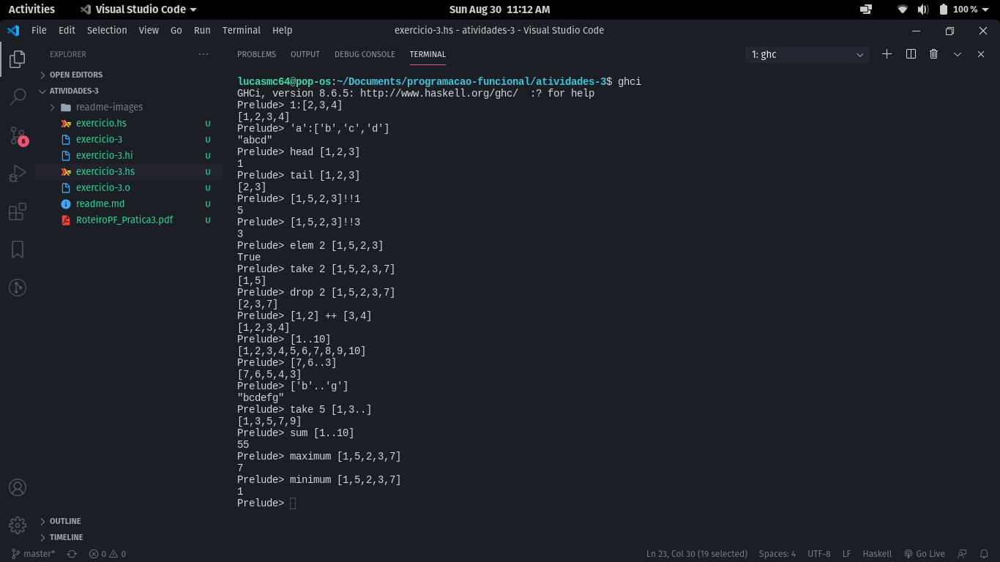

# Atividade 3 de Programação Funcional

## Exercício 1

Como são 5 definições diferentes para o mesmo operador o Haskell, 4 estam comentadas para o GHC não acusar erro enquanto estiver terminando os exercícios.

## Exercício 3

Segue o print da avaliação das expressões pedidas no exercício 3.

## Exercício 14

As respostas para o exercício 14 estão comentadas no código do arquivo *exercicio.hs*.
