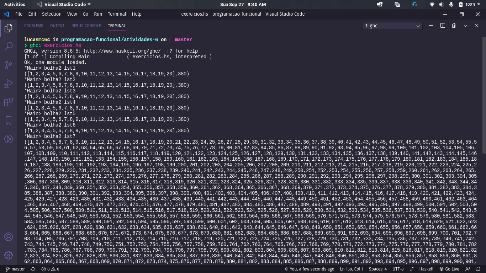
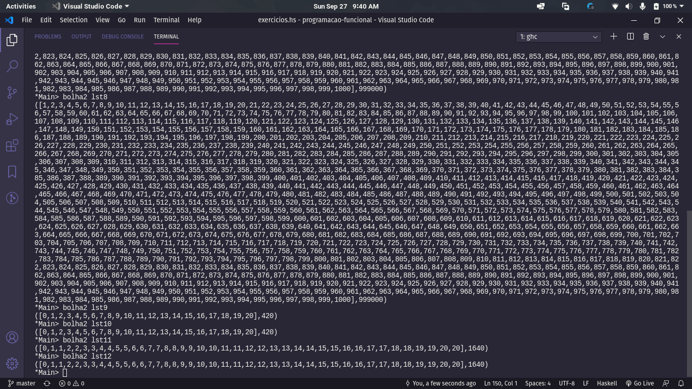
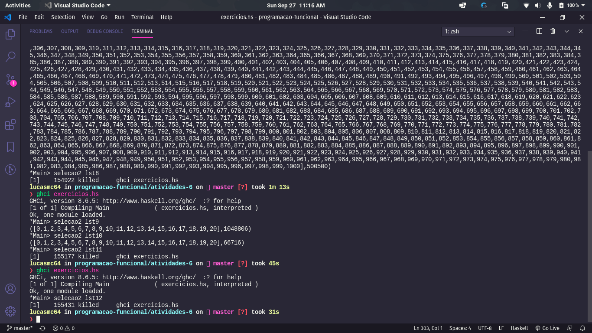
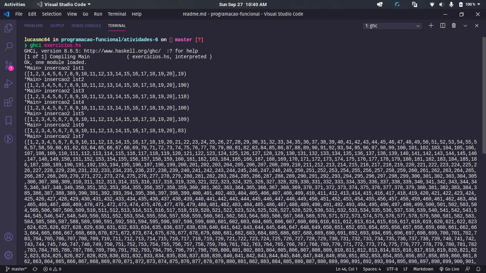
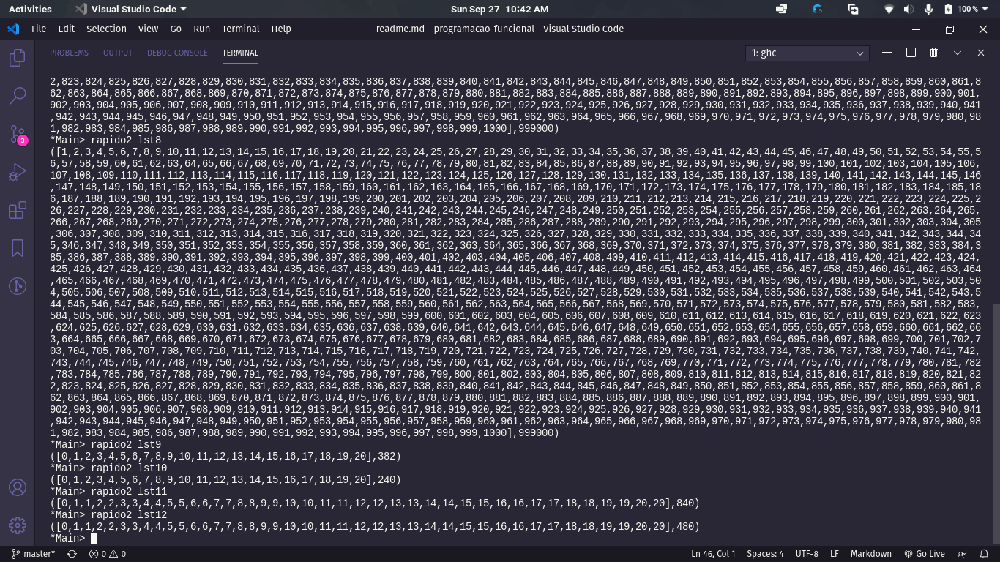
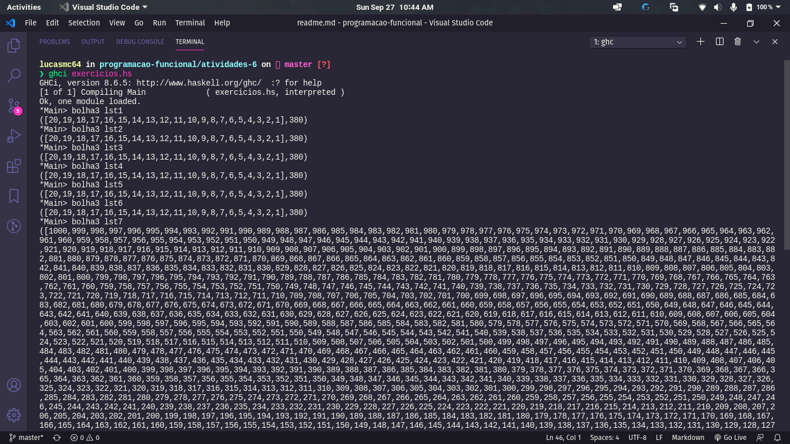
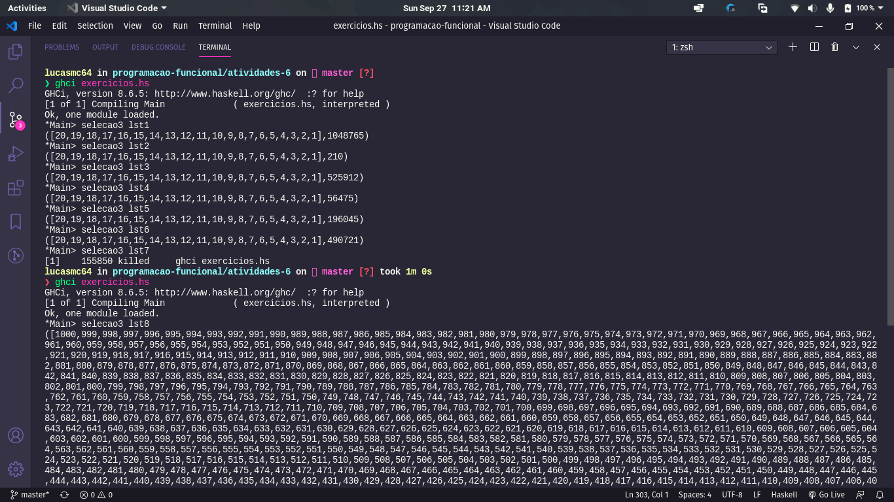
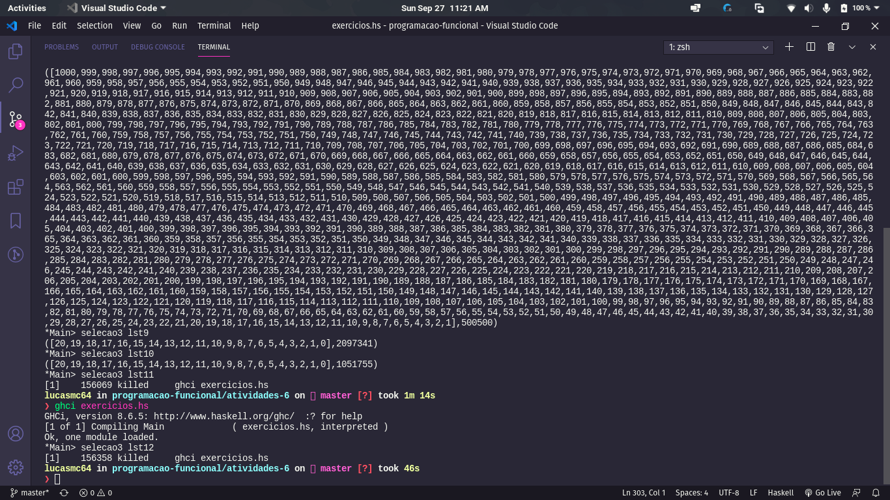
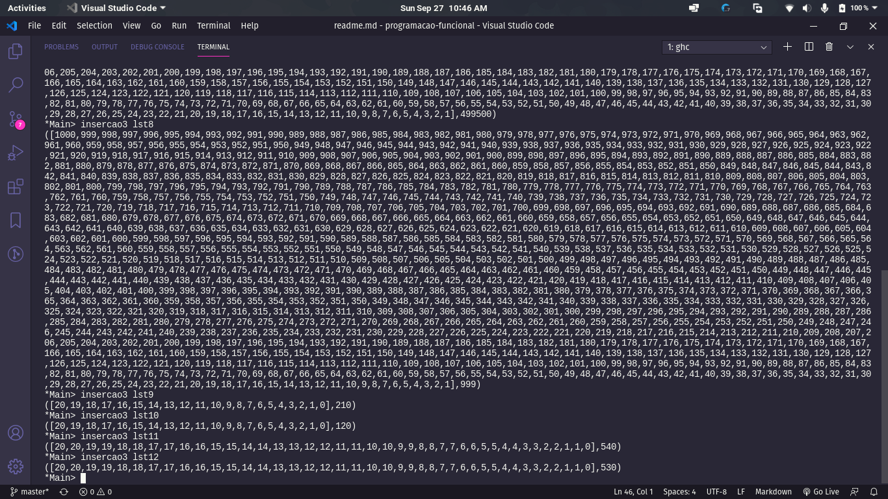
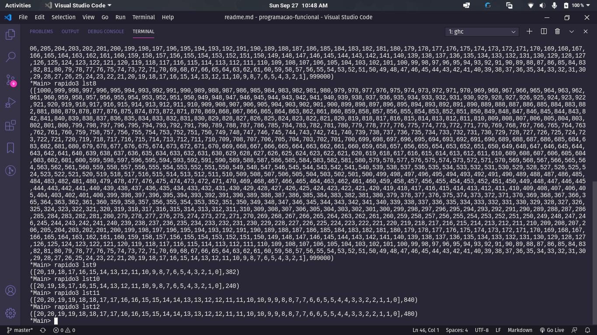

# Atividade 6 de Programação Funcional

## Exercício 11

Segue os prints da avaliação das funções e listas pedidas no exercício 11.

BubbleSort:

SelectionSort:

InsertionSort:

QuickSort:

## Exercício 12

Segue os prints da avaliação das funções e listas pedidas no exercício 12.

BubbleSort:

SelectionSort:

InsertionSort:

QuickSort:

